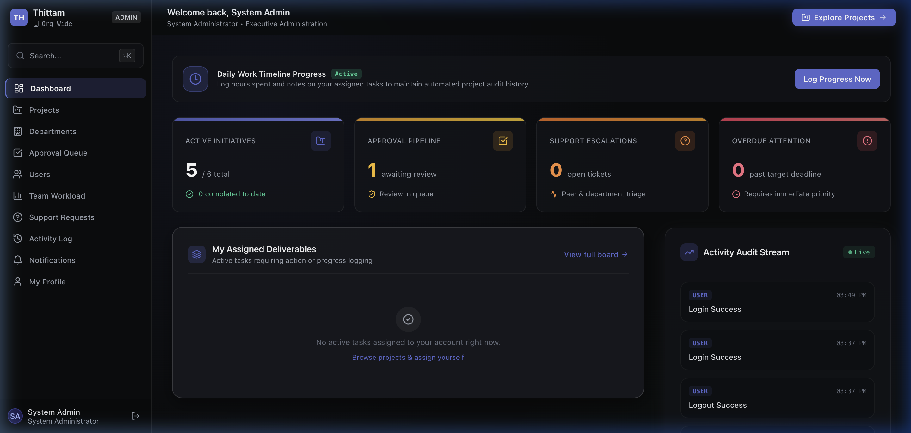
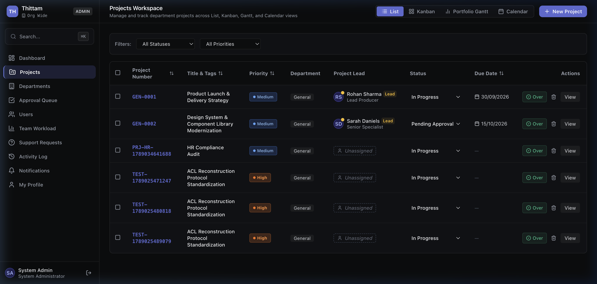
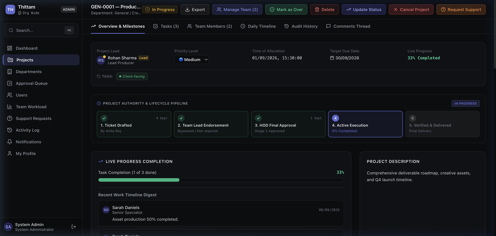

<p align="center">
  <h1 align="center">🏗️ Thittam — Project Management System</h1>
  <p align="center">
    A full-featured, enterprise-grade project management platform built for teams that need structured workflows, role-based access control, and real-time collaboration.
  </p>
</p>

<p align="center">
  
  
  
  
  
  
</p>

---

## 📸 Screenshots

<p align="center">
  
  <br/><em>Dashboard — At-a-glance overview of projects, tasks, and team activity</em>
</p>

<p align="center">
  
  <br/><em>Projects — List, Kanban, Calendar, Gantt, and Pipeline views</em>
</p>

<p align="center">
  
  <br/><em>Project Detail — Tasks, milestones, comments, attachments, and approval workflows</em>
</p>

---

## ✨ Features

### Project Management
- **Multi-view projects** — List, Kanban board, Calendar, Gantt chart, and Workflow Pipeline views
- **Task management** — Create, assign, prioritize, and track tasks with subtasks and checklists
- **Milestones** — Define and track project milestones with progress indicators
- **Task dependencies** — Set up task dependencies to manage workflow order
- **Labels & tags** — Organize projects and tasks with customizable color-coded labels
- **File attachments** — Upload and manage documents attached to projects or tasks
- **Threaded comments** — Collaborate through comments on projects with threaded discussions
- **Project history** — Full audit trail of all changes made to a project

### Approval Workflows
- **Multi-stage approvals** — Projects flow through Team Lead → HOD → Admin approval stages
- **Approval queue** — Dedicated page for reviewing and approving/rejecting pending projects
- **Approval delegation** — Delegate approval authority to other users when unavailable

### Team & Organization
- **9 user roles** — Admin, HR, HOD, Team Lead, Employee, Intern, Contractor, Client, Viewer
- **Department management** — Create departments, assign HODs, and manage teams
- **Team structure** — Organize users into teams within departments
- **Department transfers** — Request and approve user transfers between departments
- **Workload view** — Visualize team member capacity and task distribution

### People Support System
- **Support requests** — Employees can raise support requests (HR, Admin, or department-specific)
- **Escalation pipeline** — Requests route through Team Lead → HOD → Admin based on type
- **Request tracking** — Track status from submission through resolution

### Security & Access Control
- **Role-based permissions** — Granular access control based on user roles
- **CSRF protection** — Cross-site request forgery protection on all mutations
- **Session management** — Secure cookie-based sessions with heartbeat keepalive
- **Rate limiting** — Protection against brute-force login attempts
- **Account lockout** — Automatic lockout after failed login attempts
- **Activity logging** — Full audit trail of user actions

### Real-Time Collaboration
- **WebSocket integration** — Real-time updates via Socket.IO
- **Live presence** — See who else is viewing the same project
- **Instant notifications** — Real-time notification delivery

### Additional Features
- **Global search** — Search across projects and tasks instantly (Ctrl/⌘ + K)
- **Dark mode UI** — Beautiful dark-themed interface throughout
- **Notification preferences** — Customize which notifications you receive
- **Timeline tracking** — Log hours spent on tasks with daily timeline entries
- **Export capabilities** — Export project data for reporting

---

## 🏗️ Tech Stack

| Layer | Technology |
|-------|-----------|
| **Framework** | [Next.js 14](https://nextjs.org/) (App Router) |
| **Language** | [TypeScript 5.6](https://www.typescriptlang.org/) |
| **Database** | [SQLite](https://sqlite.org/) (dev) / [PostgreSQL 16](https://www.postgresql.org/) (production) |
| **ORM** | [Prisma 5.21](https://www.prisma.io/) |
| **Real-time** | [Socket.IO 4.8](https://socket.io/) |
| **Styling** | [Tailwind CSS 3.4](https://tailwindcss.com/) |
| **UI Components** | Custom components + [Lucide Icons](https://lucide.dev/) |
| **Charts** | [Recharts 2.13](https://recharts.org/) |
| **Drag & Drop** | [@dnd-kit](https://dndkit.com/) |
| **Auth** | Custom session-based (bcrypt + secure cookies) |
| **Server** | Custom Node.js server (Next.js + Socket.IO) |

---

## 📁 Project Structure

```
thittam-pm/
├── prisma/
│   ├── schema.prisma          # Database schema (23 models)
│   └── seed.ts                # Demo data seeder
├── server.js                  # Custom Node server (Next.js + WebSocket)
├── src/
│   ├── app/
│   │   ├── (auth)/            # Login & password reset pages
│   │   ├── (dashboard)/       # All authenticated pages
│   │   │   ├── dashboard/     # Main dashboard
│   │   │   ├── projects/      # Projects list & detail
│   │   │   ├── departments/   # Department management
│   │   │   ├── users/         # User management
│   │   │   ├── workload/      # Team workload view
│   │   │   ├── support-requests/
│   │   │   ├── notifications/
│   │   │   ├── activity-log/
│   │   │   ├── approval-queue/
│   │   │   └── profile/
│   │   └── api/               # REST API routes
│   │       ├── auth/          # Login, logout, session
│   │       ├── projects/      # CRUD + approve/reject
│   │       ├── tasks/         # CRUD + subtasks, comments, dependencies
│   │       ├── users/         # User management
│   │       ├── departments/   # Departments + transfers
│   │       ├── notifications/ # Notifications + preferences
│   │       ├── support-requests/
│   │       ├── workload/
│   │       ├── timeline/
│   │       ├── delegations/
│   │       ├── attachments/
│   │       ├── labels/
│   │       ├── search/
│   │       └── activity-log/
│   ├── components/
│   │   ├── projects/          # Project views (List, Kanban, Gantt, Calendar, Pipeline)
│   │   ├── tasks/             # Task detail drawer
│   │   ├── comments/          # Comment threads
│   │   ├── support/           # Support request stepper
│   │   ├── layout/            # Header, Sidebar, Search modal
│   │   ├── providers/         # Socket.IO provider
│   │   └── ui/                # Reusable UI components
│   ├── lib/
│   │   ├── auth.ts            # Session management
│   │   ├── db.ts              # Prisma client singleton
│   │   ├── permissions.ts     # Role-based access control
│   │   ├── security.ts        # CSRF & input sanitization
│   │   ├── rateLimit.ts       # Rate limiting
│   │   ├── types.ts           # TypeScript type definitions
│   │   └── socket-server.ts   # Socket.IO server types
│   └── middleware.ts          # Auth middleware (route protection)
├── docker-compose.yml         # Docker setup (PostgreSQL)
├── tailwind.config.js
├── tsconfig.json
└── package.json
```

---

## 🚀 Getting Started

### Prerequisites

- **Node.js** 18+ 
- **npm** 9+

### Installation

```bash
# 1. Clone the repository
git clone https://github.com/shreenihil/thittam-pm.git
cd thittam-pm

# 2. Install dependencies
npm install

# 3. Set up environment variables
cp .env.example .env
# Or create .env manually with:
#   DATABASE_URL="file:./dev.db"
#   UPLOAD_DIR="./uploads"
#   PORT=3000

# 4. Initialize the database
npx prisma db push

# 5. Seed demo data
npm run db:seed

# 6. Start the development server
npm run dev
```

The app will be available at **http://localhost:3000**

### Demo Accounts

All demo accounts use the password: **`thittam123`**

| Role | Email | Access Level |
|------|-------|-------------|
| **Admin** | `admin@thittam.local` | Full system access |
| **HR** | `hr@thittam.local` | HR operations, user management |
| **HOD** | `hod@thittam.local` | Department head, approvals |
| **Team Lead** | `teamlead@thittam.local` | Team management, task assignment |
| **Employee** | `employee@thittam.local` | Project & task work |
| **Intern** | `intern@thittam.local` | Limited project access |
| **Contractor** | `contractor@thittam.local` | Assigned projects only |
| **Client** | `client@thittam.local` | View assigned projects |
| **Viewer** | `viewer@thittam.local` | Read-only access |

---

## 🐳 Docker Deployment (Production)

For production deployment with PostgreSQL:

```bash
docker-compose up -d
```

This starts:
- **App server** on port `3000`
- **PostgreSQL 16** on port `5432`

---

## 📊 Database Schema

The application uses **23 models** to manage the full project lifecycle:

```
Department ──┬── Team ──── User
             │              ├── Session
             │              ├── Project ──┬── Task ──┬── Subtask
             │              │             │          ├── Comment
             │              │             │          ├── TaskDependency
             │              │             │          └── TaskLabel
             │              │             ├── Milestone
             │              │             ├── Attachment
             │              │             ├── ProjectMember
             │              │             ├── ProjectLabel
             │              │             └── TimelineEntry
             │              ├── SupportRequest
             │              ├── Notification
             │              ├── NotificationPreference
             │              ├── ApprovalDelegation
             │              └── ActivityLog
             ├── DepartmentRequest
             └── DepartmentHistory
```

---

## 🔌 API Reference

### Authentication
| Method | Endpoint | Description |
|--------|----------|-------------|
| `POST` | `/api/auth/login` | Login with email & password |
| `POST` | `/api/auth/logout` | End session |
| `GET` | `/api/auth/me` | Get current user |
| `POST` | `/api/auth/heartbeat` | Session keepalive |
| `POST` | `/api/auth/reset-password` | Reset password |

### Projects
| Method | Endpoint | Description |
|--------|----------|-------------|
| `GET` | `/api/projects` | List all projects |
| `POST` | `/api/projects` | Create project |
| `GET` | `/api/projects/:id` | Get project details |
| `PATCH` | `/api/projects/:id` | Update project |
| `DELETE` | `/api/projects/:id` | Delete project |
| `POST` | `/api/projects/:id/approve` | Approve project |
| `POST` | `/api/projects/:id/reject` | Reject project |
| `GET` | `/api/projects/:id/milestones` | Get milestones |
| `GET` | `/api/projects/:id/history` | Get change history |

### Tasks
| Method | Endpoint | Description |
|--------|----------|-------------|
| `GET` | `/api/tasks` | List all tasks |
| `POST` | `/api/tasks` | Create task |
| `GET` | `/api/tasks/:id` | Get task details |
| `PATCH` | `/api/tasks/:id` | Update task |
| `DELETE` | `/api/tasks/:id` | Delete task |
| `POST` | `/api/tasks/:id/subtasks` | Add subtask |
| `PATCH` | `/api/tasks/:id/subtasks` | Toggle subtask |
| `POST` | `/api/tasks/:id/comments` | Add comment |
| `GET` | `/api/tasks/:id/dependencies` | Get dependencies |

### Other Endpoints
| Method | Endpoint | Description |
|--------|----------|-------------|
| `GET/POST` | `/api/users` | User management |
| `GET/POST/PATCH` | `/api/departments` | Department management |
| `GET/POST` | `/api/labels` | Label management |
| `GET` | `/api/notifications` | Get notifications |
| `GET` | `/api/workload` | Team workload data |
| `GET` | `/api/search?q=` | Global search |
| `GET/POST` | `/api/support-requests` | Support requests |
| `GET/POST` | `/api/timeline` | Timeline entries |
| `GET/POST` | `/api/delegations` | Approval delegations |
| `POST` | `/api/attachments` | File upload |
| `GET` | `/api/activity-log` | Audit logs |

---

## 🛡️ Security Features

- **Session-based authentication** with secure, HTTP-only cookies
- **CSRF tokens** validated on all state-changing requests
- **Rate limiting** on login endpoint (5 attempts / 15 min window)
- **Account lockout** after repeated failed login attempts
- **Input sanitization** to prevent XSS attacks
- **Role-based access control** enforced on every API route
- **Project-level permissions** — users only see projects they have access to

---

## 📝 Available Scripts

| Script | Description |
|--------|-------------|
| `npm run dev` | Start development server (with WebSocket) |
| `npm run build` | Build for production |
| `npm start` | Start production server |
| `npm run lint` | Run ESLint |
| `npm run db:push` | Push schema changes to database |
| `npm run db:seed` | Seed database with demo data |

---

## 🤝 Contributing

1. Fork the repository
2. Create your feature branch (`git checkout -b feature/amazing-feature`)
3. Commit your changes (`git commit -m 'Add amazing feature'`)
4. Push to the branch (`git push origin feature/amazing-feature`)
5. Open a Pull Request

---

## 📄 License

This project is private and proprietary. All rights reserved.

---

<p align="center">
  Built with ❤️ using Next.js, TypeScript, and Prisma
</p>
